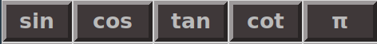
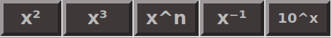
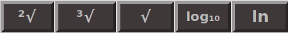
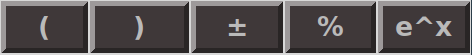
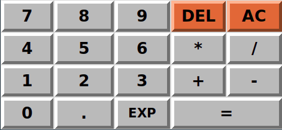

# 🎉 Tkinter Calculator 🎉

🧮 Scientific Calculator using Python's library Tkinter 🧮

   

📚 Explanation of Each Button and Corresponding Function 📚

**1st Row 🔝**

   

- **abs 📏** : The absolute value of a number (e.g., `abs(-5) = 5`).
- **mod 📊** : From *modulo*, the operation to find the remainder of the division of one number by another.  
&nbsp; &nbsp; &nbsp; &nbsp; &nbsp; &nbsp; In Python, we use the symbol `%` (e.g., `5 % 2 = 1`).
- **div ➗️** : Floor division returns the result of the division rounded down to the nearest integer.  
&nbsp; &nbsp; &nbsp; &nbsp; &nbsp; In Python, we use the symbol `//` (e.g., `8 // 3 = 2`).
- **x! 🎉** : The factorial of the number x (e.g., `4! = 24`).
- **e ℮️** : Euler's number, a mathematical constant approximately equal to 2.71828.

**2nd Row 🔝**

   

- **sin 📐** : Sine of an angle θ in degrees (e.g., `sin(90) = 1`).
- **cos 📐** : Cosine of an angle θ in degrees (e.g., `cos(180) = -1`).
- **tan 📐** : Tangent of an angle θ in degrees (e.g., `tan(45) = 1`).
- **cot 📐** : Cotangent of an angle θ in degrees (e.g., `cot(45) = 1 / tan(45) = 1`).
- **π ℼ️** : Archimedes' constant defined as the ratio of a circle's circumference to its diameter, approximately equal to 3.14159.

**3rd Row 🔝**

   

- **x² ⏫️** : x raised to the power of 2 (e.g., `4² = 16`).
- **x³ ⏫️** : x raised to the power of 3 (e.g., `5³ = 125`).
- **xⁿ ⏫️** : x raised to any power (e.g., `2⁴ = 16`).
- **x⁻¹ ⏫️** : x raised to the power of (-1), the inverse of number x (e.g., `2⁻¹ = 0.5`).
- **10ˣ ⏫️** : Powers of 10 (e.g., `10³ = 1000`).

**4th Row 🔝**

   

- **²√ √️** : Square root of a number (e.g., `²√144 = 12`).
- **³√ √️** : Cube root of a number (e.g., `³√8 = 2`).
- **√ √️** : Any root of a number (e.g., `⁴√16 = 2`).
- **log₁₀ 📊** : The logarithm of a number with base 10 (e.g., `log₁₀(1000) = 3`).
- **ln 📊** : The logarithm of a number with base e (e.g., `logₑ(e) = ln(e) = 1`).

**5th Row 🔝**

   

- **( 📝** : Left parenthesis.
- **) 📝** : Right parenthesis.
- **± 🔄** : Change the sign of a number.
- **% 📊** : Find the percentage of a number (e.g., `5% = 0.05`).
- **eˣ 📊** : Exponential function (e.g., `e² ≈ 7.389`).

**6th, 7th, 8th, 9th Row 🔝**

   

In these rows are:

- The basic number buttons (0 to 9).
- The basic math symbols (operators) (+, -, *, /).
- The equal sign (=) and decimal point (.).
- Button **DEL 🗑️** to delete one or more characters from the end of the entry.
- Button **AC 🗑️** to delete the whole entry.
- **EXP 📊** : Multiply any number with powers of 10 (e.g., `2 * 10³ = 2000`).

💡 Feel free to suggest any new emojis or changes to make it more attractive and user-friendly! 💡
